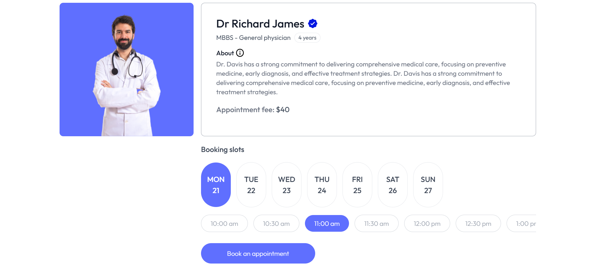
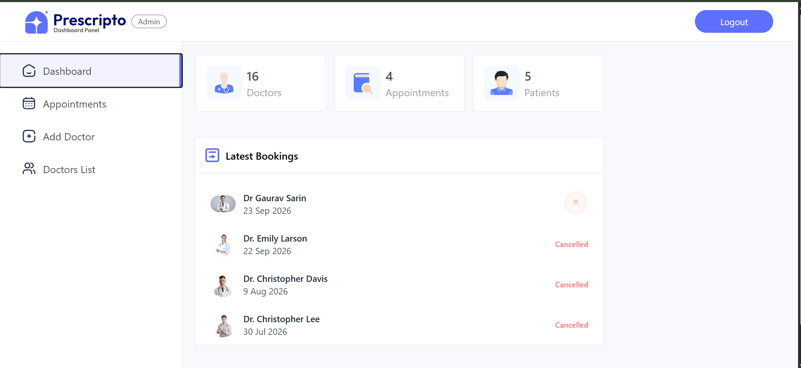

# Prescripto — Doctor Appointment Booking Platform

Prescripto is a full-stack MERN application that lets patients find and book appointments with doctors online, pay securely through Razorpay, and manage their bookings — while doctors and admins run the backend of the practice from their own dedicated dashboards.

## Project Highlights

- Full-stack MERN application with separate patient, doctor, and admin interfaces
- Role-based JWT authentication with dedicated middleware per role
- Real-time doctor availability reflected instantly across the patient-facing app
- Razorpay payment integration with server-side payment verification
- Cloudinary-based image upload and storage for profile pictures
- RESTful backend with modular controllers, routes, middleware, and Mongoose models

## Core User Flow

**Patient**
```
Browse Doctors → Check Availability → Select Slot → Razorpay Payment
→ Payment Verification → Appointment Confirmed
```

**Admin**
```
Manage Doctors → Set Availability → View & Manage Appointments
```

---

## Screenshots

| Home | Doctors Listing |
|---|---|
|  |  |

| Appointment Booking | Admin Dashboard |
|---|---|
|  |  |

---

## Features

### Patient
- User registration and login
- Browse doctors by speciality
- View doctor profiles and availability
- Book doctor appointments
- Online appointment payments using Razorpay
- Verify Razorpay payments
- View and cancel appointments
- Manage personal profile
- Upload profile images

### Doctor
- Secure doctor login
- View scheduled appointments
- Complete or cancel appointments
- View dashboard statistics
- View and update doctor profile

### Admin
- Secure admin authentication
- Add and manage doctors
- Upload doctor images
- Change doctor availability
- View all appointments
- Cancel appointments
- View dashboard statistics

---

## Tech Stack

**Frontend (Patient)**
- React.js, Vite
- React Router
- Tailwind CSS
- Axios
- React Toastify

**Admin / Doctor Panel**
- React.js, Vite
- Tailwind CSS
- Axios
- React Toastify

**Backend**
- Node.js, Express.js
- MongoDB, Mongoose
- JWT, bcrypt
- Multer, Cloudinary
- Razorpay
- CORS, dotenv

---

## Architecture

```text
Prescripto
│
├── frontend/          # Patient-facing React application
│
├── admin/             # Admin and doctor dashboard
│
└── backend/           # Express REST API
    ├── controllers/
    ├── middlewares/
    ├── models/
    ├── routes/
    ├── config/
    └── seed/
```

```text
Patient Frontend ──────┐
                       │
Admin / Doctor Panel ──┼──> Express REST API ──> MongoDB
                       │
                       ├──> Cloudinary
                       │
                       └──> Razorpay
```

---

## Authentication & Authorization

JWT-based authentication with separate middleware for patients, doctors, and administrators. Passwords are hashed using bcrypt. Protected routes require the appropriate authentication token and role.

## Payments

Razorpay is integrated for online appointment payments:

1. Appointment payment request
2. Razorpay order creation
3. Payment completion
4. Payment verification
5. Appointment payment status update

## Image Uploads

Cloudinary stores uploaded images (doctor and patient profile pictures). Multer handles multipart form-data uploads on the backend.

## Availability Management

Administrators can change a doctor's availability from the admin panel. The status is persisted in MongoDB and reflected across the patient-facing app. Patients cannot book appointments with unavailable doctors.

---

## Getting Started

### Prerequisites
- Node.js & npm
- MongoDB / MongoDB Atlas account
- Cloudinary account
- Razorpay account
- Git

### 1. Clone the repository
```bash
git clone https://github.com/utkarshpandey336-sketch/Prescripto_final_project.git
cd Prescripto_final_project
```

### 2. Install dependencies
```bash
cd backend && npm install
cd ../frontend && npm install
cd ../admin && npm install
```

### 3. Configure environment variables

Create `.env` files locally (do **not** commit these):
```text
backend/.env
frontend/.env
admin/.env
```

`backend/.env` typically needs:
```
MONGODB_URI=your_mongodb_connection_string
CLOUDINARY_NAME=your_cloudinary_cloud_name
CLOUDINARY_API_KEY=your_cloudinary_api_key
CLOUDINARY_SECRET_KEY=your_cloudinary_api_secret
ADMIN_EMAIL=your_admin_email
ADMIN_PASSWORD=your_admin_password
JWT_SECRET=your_jwt_secret
RAZORPAY_KEY_ID=your_razorpay_key_id
RAZORPAY_KEY_SECRET=your_razorpay_key_secret
CURRENCY=INR
```

### 4. Run the apps
```bash
# Backend (http://localhost:4000)
cd backend && npm run server

# Patient frontend
cd frontend && npm run dev

# Admin/doctor panel
cd admin && npm run dev
```

---

## Project Structure

```text
backend/
├── config/
│   ├── cloudinary.js
│   └── mongodb.js
├── controllers/
│   ├── adminController.js
│   ├── doctorController.js
│   └── userController.js
├── middlewares/
│   ├── authAdmin.js
│   ├── authDoctor.js
│   ├── authUser.js
│   └── multer.js
├── models/
│   ├── appointmentModel.js
│   ├── doctorModel.js
│   └── userModel.js
├── routes/
│   ├── adminRoute.js
│   ├── doctorRoute.js
│   └── userRoute.js
└── server.js

frontend/
└── src/
    ├── components/
    ├── context/
    ├── pages/
    └── assets/

admin/
└── src/
    ├── components/
    ├── context/
    ├── pages/
    └── assets/
```

## Engineering Highlights

- Role-based JWT authentication with separate patient, doctor, and admin middleware
- REST API architecture using Express controllers and modular route files
- MongoDB persistence with Mongoose schemas for users, doctors, and appointments
- Razorpay order creation and signature-verified payment confirmation
- Cloudinary-based image storage for doctor and patient profile pictures
- Persistent doctor availability state kept in sync with the patient-facing app
- Protected, role-guarded routes for appointment and doctor management operations

---

## Current Status

This is a fully functional full-stack application with core features working end-to-end: authentication, doctor browsing, booking, payments, doctor availability management, and admin management.

The application is deployed and accessible online:

* **Patient Application:** https://prescripto-frontend-psi-three.vercel.app/
* **Admin / Doctor Panel:** https://prescripto-admin-two-gamma.vercel.app/
* **Backend API:** https://prescripto-final-project.onrender.com

## Roadmap

* [ ] Automated testing (Jest + Supertest, React Testing Library)
* [ ] Improved appointment scheduling and slot-conflict handling
* [ ] Email/SMS appointment notifications
* [ ] Server-side pagination and filtering
* [ ] Rate limiting on authentication routes
* [ ] Enhanced analytics dashboards
* [ ] Production-grade logging and monitoring
